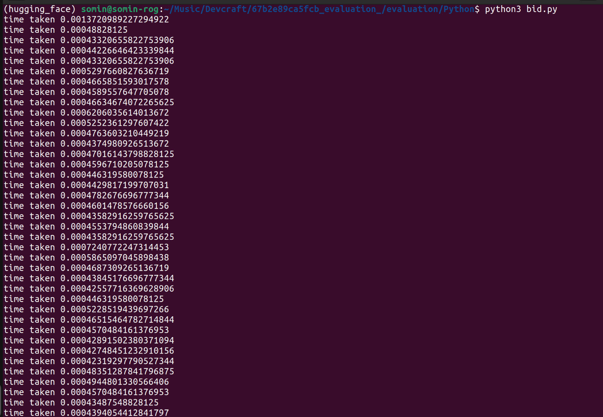
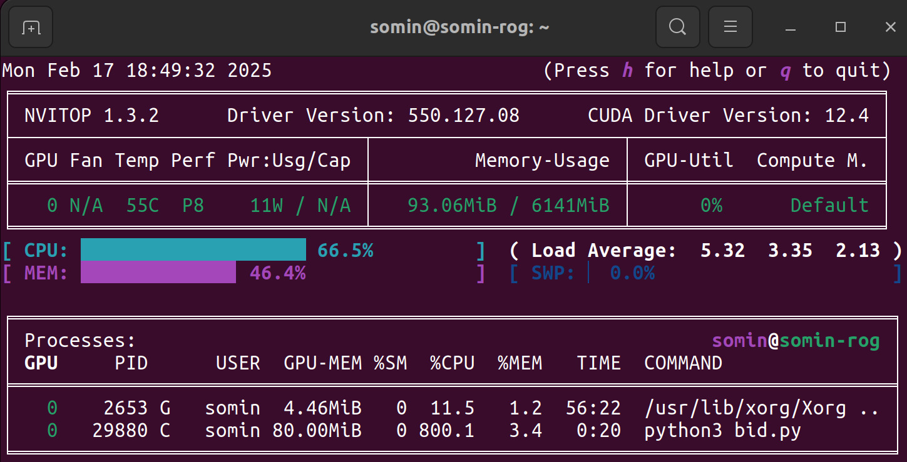
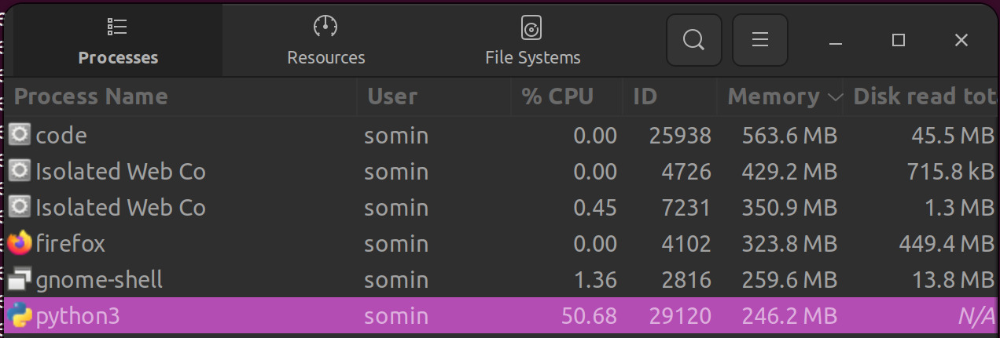

# Adobe DevCraft Bidding System 🚀

> A sophisticated bidding system implementation for real-time ad auctions, supporting both Python and Java implementations.


## ⚡ Quick Start

### 🔧 Installation

1. **Install dependencies:**
   ```bash
   pip install -r requirements.txt
   ```
   
   **Or use the setup script:**
   ```bash
   python setup.py install
   ```

2. **Configure environment:**
   ```bash
   # If using conda
   conda env create -f environment.yaml
   ```

 **Inference Time of model:**


**Memory Footprint**
GPU footprint

CPU footprint


